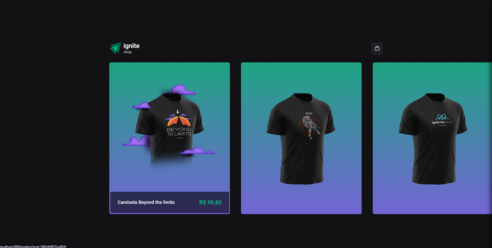
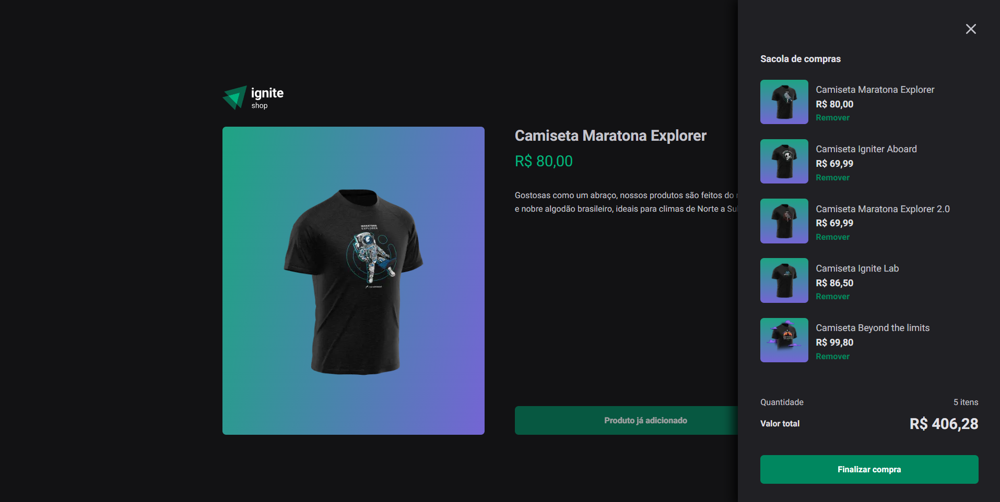
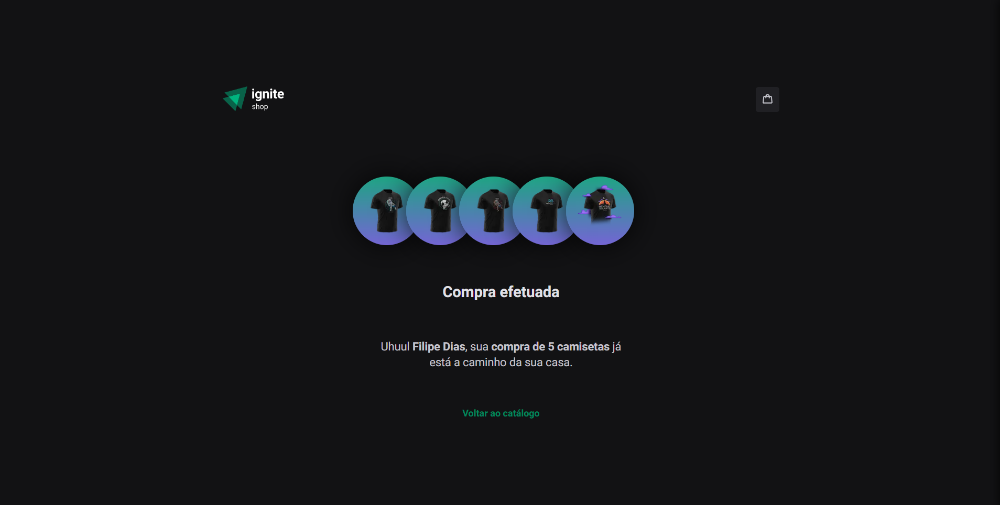

<div align="center">
  <h1> IGNITE SHOP </h1>
   
  <h6> Projeto desenvolvido do Desafio 04 do Ignite React JS </h6>
</div>

<br />
<hr width="100%"/>
<br />

<div align="center">
  <p>Uma loja virtual com plataforma de pagamento integrada onde você pode comprar as melhores camisetas da Rocketseat</p>
</div>

<br />

<div align="center">
  
</div>


<div align="center"> 
  <h3>Mais imagens</h3>
  
  
  
</div>

<br />
<hr width="100%"/>
<br />

### Techs:
- NextJs
- Stripe
- Stitches
- Api do NextJs
- Typescript

 
### Como rodar o projeto:
```
# Clone o projeto
git clone https://github.com/FilipeDiasLima/Ignite-Shop.git

# Abra o projeto
cd ./Ignite-Shop

# Instale as dependências
yarn ou npm install

# Execute
yarn dev
ou
yarn build
yarn start
```


### Obrigado
